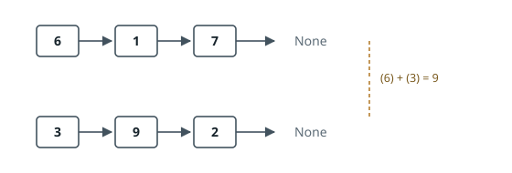

# Add Digit Lists

## Description

Two non-negative integers are each supplied as a singly-linked list of decimal
digits, **least significant digit first**: the head node holds the ones digit,
the node after it the tens digit, and so on. Every node holds exactly one digit.

Return the sum of the two integers in that same form.

Neither input carries a leading zero — no trailing node holding `0` — unless the
integer it encodes is `0`.

### Example 1

```text
Input: first = [6,1,7], second = [3,9,2]
Output: [9,0,0,1]
Explanation: The lists encode 716 and 293, whose sum 1009 is written [9,0,0,1].
```



### Example 2

```text
Input: first = [5], second = [5]
Output: [0,1]
Explanation: 5 + 5 is 10, so the carry out of the last column becomes a new node.
```

### Example 3

```text
Input: first = [8,8,8,8,8], second = [4,7]
Output: [2,6,9,8,8]
Explanation: 88888 + 74 = 88962. The shorter list runs out first.
```

### Constraints

- Each list holds between `1` and `100` nodes.
- `0 <= Node.val <= 9`
- Neither encoded integer has a leading zero.

## Hints

### Hint 1

Written out by hand, addition works one column at a time from the right. The
order the digits are stored in already matches that direction, so a single
forward walk is enough.

### Hint 2

Exactly one piece of information has to survive from each column to the next.
What is it, and what does it equal before the first column?

### Hint 3

Two things outlive the shorter list: the digits still left in the longer one,
and possibly a final carry after both have ended.
