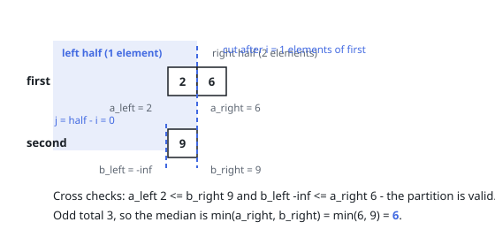

# Solutions — Combined Median

## Binary search on the partition

Think of the median as the seam where the combined ordering divides into a
lower and an upper half. Rather than building that ordering, choose how many
elements `first` contributes to the lower half — a cut after `i` elements —
and the cut in `second` follows from the half's fixed size:
`j = half - i` with `half = (m + n) // 2`. The entire question collapses to
one integer `i`, so binary search applies. The code swaps the arrays when
needed so `first` is the shorter; that shrinks the search range and keeps
`j` inside `[0, n]` for every candidate.

A pair of cuts `(i, j)` is the right one precisely when nothing below the
seam exceeds anything above it. Sortedness reduces that global condition to
the four neighbours of the two cuts: `a_left <= b_right` and
`b_left <= a_right`, where `a_left`/`a_right` flank the cut in `first` and
`b_left`/`b_right` flank it in `second`. Sentinel infinities define the
missing neighbours of boundary cuts — `float("-inf")` when a cut sits before
the first element, `float("inf")` when it sits past the last — so a half
taking zero or all elements of one array needs no branch of its own. When
`a_left > b_right`, `first` is donating too much and `hi` falls to `i - 1`;
otherwise it is donating too little and `lo` rises to `i + 1`.

With a valid partition in hand the median reads off the seam directly. The
lower half is built to be the smaller one when the total is odd, so the
median is then the least element of the upper half, `min(a_right, b_right)`;
when the total is even it is the mean of the greatest element below the seam,
`max(a_left, b_left)`, and the least above it, `min(a_right, b_right)`. An
empty shorter array costs nothing extra: the search tests `i = 0` at once,
the sentinels take over, and the answer is the longer array's own median.

**Complexity:** `O(log(min(m, n)))` time, `O(1)` space.
