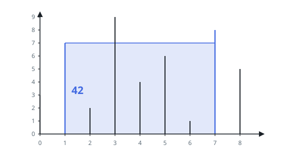
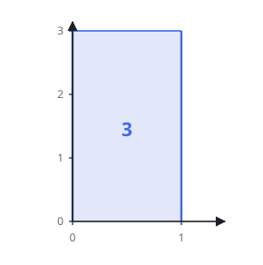

# Largest Water Container

## Description

Read `heights[i]` as a vertical wall of that height standing at position `i` on
a flat floor. Any two walls, together with the floor between them, hold water
up to the level of the shorter wall — above that it spills over.

Picking the walls at positions `i` and `j` with `i < j`, the volume held is

```text
(j - i) * min(heights[i], heights[j])
```

Return the largest volume attainable by any pair of walls. The walls stay
upright; the container is never tilted.

### Example 1

```text
Input: heights = [3,7,2,9,4,6,1,8,5]
Output: 42
Explanation: The walls at positions 1 and 7 are 6 apart and the shorter is 7,
holding 6 * 7 = 42. The tallest wall of all, the 9 at position 3, is in no
optimal pair.
```



### Example 2

```text
Input: heights = [3,3]
Output: 3
Explanation: Only one pair exists: width 1, level 3.
```



### Example 3

```text
Input: heights = [1,2,4,3]
Output: 4
Explanation: The widest pair holds 3 * 1 = 3, but positions 1 and 3 hold
2 * 2 = 4. Width alone does not decide it.
```

### Constraints

- `n == heights.length`
- `2 <= n <= 10^5`
- `0 <= heights[i] <= 10^4`

## Hints

### Hint 1

There are about `n²/2` pairs and `n` reaches `10^5`, so the answer has to come
from a sweep that never looks at most of them.

### Hint 2

Begin with the widest pair there is — one wall at each end. Every other pair is
narrower, so it can only beat this one by being held to a higher level.

### Hint 3

Compare the two end walls. Keeping the shorter one and moving the taller one
inward loses width and cannot gain level, since the shorter wall still caps the
water. So the shorter wall is the one with nothing left to offer.
