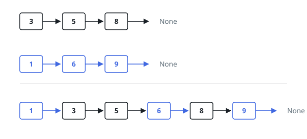

# Splice Two Sorted Lists

## Description

Two linked lists are given by their head nodes, `first` and `second`, and
both hold their values in non-decreasing order.

Thread them into a single linked list that is sorted as well, reusing the
original nodes — relink them rather than building new ones — and return the
head of the result.

### Example 1

```text
Input: first = [3,5,8], second = [1,6,9]
Output: [1,3,5,6,8,9]
Explanation: The smaller current head is taken at every step, so the nodes of
the two lists interleave.
```



### Example 2

```text
Input: first = [], second = [4]
Output: [4]
Explanation: An empty list contributes nothing; the other list passes through
unchanged.
```

### Example 3

```text
Input: first = [2,9], second = [1,3,3,8]
Output: [1,2,3,3,8,9]
Explanation: Lengths and duplicates are both fine — the second list simply
supplies several nodes in a row once it takes the lead.
```

### Constraints

- Both lists hold between `0` and `50` nodes.
- `-100 <= node value <= 100`
- `first` and `second` are each in non-decreasing order.

## Hints

### Hint 1

Start from a placeholder node so that attaching the very first real node is
not a special case.

### Hint 2

At each step the next node of the result is the smaller of the two current
heads; link it to the tail you are building and step that list forward.

### Hint 3

Once one list runs dry, its partner's remaining nodes are already in order —
attach the whole remainder in one link.
