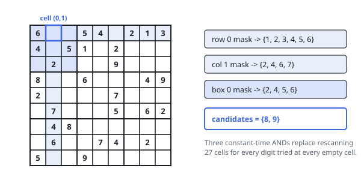

# Solutions — Fill A Sudoku Grid

## Backtracking with bitmask constraint sets

Search is unavoidable here, so the whole game is making each step of the search
cheap. A single sweep of the grid does two things: it lists the coordinates of
every undecided cell, and it builds 27 nine-bit sets recording which digits are
already spoken for — one set per row, one per column, one per block, where a
block is indexed by `(r // 3) * 3 + c // 3` and a digit `d` occupies bit
`1 << d`. From then on the question "may `d` go here?" is answered by three
bitwise ANDs rather than by reading 27 neighbouring cells.

The recursion walks the list of undecided cells in order. At cell `k` it tries
every digit whose bit is clear in all three of that cell's sets; committing to
one means setting those three bits and writing the character into the grid,
after which cell `k + 1` is attacked. If the whole subtree beneath that choice
dies, the commitment is rolled back — XOR clears the three bits and the cell
returns to `.` — and the next candidate digit is tried. Running off the end of
the list means every cell holds a digit that offended nobody, so the call
returns success, and that success propagates straight out of every frame
without further work.

Stopping at the first complete assignment is legitimate precisely because the
input is promised a single completion; the grid has been mutated as the search
went, so returning it needs no reconstruction. In the worked example the first
undecided cell is `(0,1)`: row 0 already holds 6, 5, 4, 2, 1 and 3, column 1
holds 2, 4, 6 and 7, and the top-left block holds 2, 4, 5 and 6, which leaves
only 8 and 9 to try there.

With `m` undecided cells, the recursion is `m` frames deep and each frame
branches over at most nine digits — a bound the masks push far below in
practice, since most cells have only one or two survivors. The 27 sets are
constant space.

**Complexity:** `O(9^m)` time, `O(m)` space.
