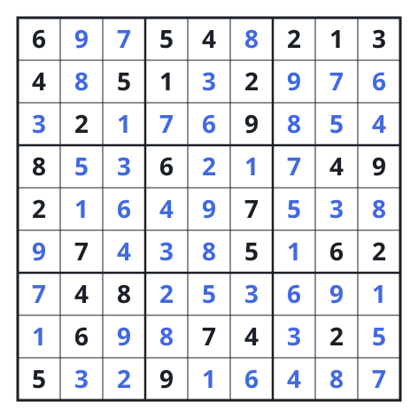

# Fill A Sudoku Grid

## Description

`board` is a `9 x 9` grid of one-character strings. A cell either already
carries one of the digits `1` through `9`, or carries `.` and is waiting to be
decided.

Replace every `.` with a digit so that the finished grid obeys three
conditions at once:

- no digit repeats within a row,
- no digit repeats within a column,
- no digit repeats within any of the nine `3 x 3` blocks the grid divides into.

Write the digits into `board` itself and return it. Exactly one filling
satisfies all three conditions, so there is no choice to make about which
answer to report.

### Example 1

```text
Input: board = [["6",".",".","5","4",".","2","1","3"],["4",".","5","1",".","2",".",".","."],[".","2",".",".",".","9",".",".","."],["8",".",".","6",".",".",".","4","9"],["2",".",".",".",".","7",".",".","."],[".","7",".",".",".","5",".","6","2"],[".","4","8",".",".",".",".",".","."],[".","6",".",".","7","4",".","2","."],["5",".",".","9",".",".",".",".","."]]
Output: [["6","9","7","5","4","8","2","1","3"],["4","8","5","1","3","2","9","7","6"],["3","2","1","7","6","9","8","5","4"],["8","5","3","6","2","1","7","4","9"],["2","1","6","4","9","7","5","3","8"],["9","7","4","3","8","5","1","6","2"],["7","4","8","2","5","3","6","9","1"],["1","6","9","8","7","4","3","2","5"],["5","3","2","9","1","6","4","8","7"]]
Explanation: Thirty cells were given; the other fifty-one are forced.
```



### Constraints

- `board.length == 9`
- `board[i].length == 9`
- Each `board[i][j]` is either `.` or one of the digits `1`–`9`.
- The grid admits exactly one completion.

## Hints

### Hint 1

Fix an order on the undecided cells and work through them one at a time. A
digit that is legal now may still turn out to be wrong later, so any placement
has to be revocable.

### Hint 2

When a placement leads to a cell with no legal digit at all, the mistake is
somewhere behind you. Undo the last placement, take the next digit there, and
carry on — the search only ever moves forward or one step back.

### Hint 3

Asking "is this digit legal here?" by rescanning a row, a column and a block
costs 27 reads. Keep instead one nine-bit set per row, per column and per
block, and the same question is three bitwise ANDs.
