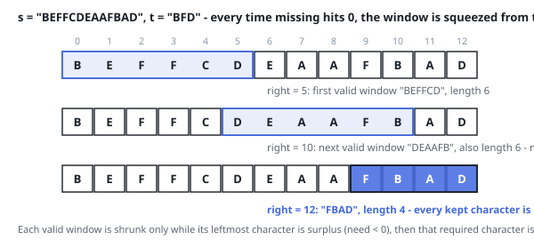

# Solutions — Smallest Covering Window

## Sliding Window with a Deficit Counter

Two numbers carry the whole window state. `need[c]` says how many further
copies of character `c` the window owes (seeded from `t`'s counts), and
`missing` totals those debts across the alphabet — so coverage is the single
test `missing == 0`. When the right end admits a character that still owes
copies (`need[ch] > 0`), `missing` drops by one; the debt for `ch` then drops
unconditionally, which is what lets surplus copies and letters foreign to `t`
sink negative without disturbing `missing` again.

The moment the debts clear, the interval `[left, right]` is a cover, and the
left end is advanced while its leading character sits below quota — each
departure refunds a copy to the books. The advance halts on the first
character at exactly its quota, giving the tightest cover that ends here;
if it is the shortest seen so far it is kept. To continue the sweep the code
then pushes that boundary character out on purpose (`need[s[left]] += 1`,
`missing += 1`, `left += 1`), re-opening exactly one debt. Both ends travel
strictly left to right, so every extension and every refund across the run
adds up to linear work beyond the initial tally of `t`.

Impossible inputs exit early: a `t` longer than `s` (or empty) yields `""`
before any scanning starts, and if no interval ever clears its debts the
best length stays infinite and `""` comes back at the end. The books are
keyed by character, so they never exceed the 52-letter alphabet regardless
of how long the strings are.

**Complexity:** `O(m + n)` time, `O(1)` space.
