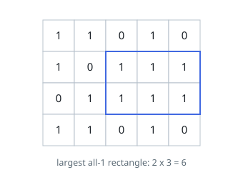

# Largest Ones Rectangle

## Description

You are given a grid with `rows` rows and `cols` columns, whose cells hold
the characters `'1'` and `'0'`.

Find the largest axis-aligned block of cells that contains only `'1'`s and
return its area, counted in cells.

### Example 1

```text
Input: matrix = [["1","1","0","1","0"],["1","0","1","1","1"],["0","1","1","1","1"],["1","1","0","1","0"]]
Output: 6
Explanation: Rows 1 and 2, columns 2 through 4 are all '1', a 2 x 3 block.
No other all-'1' block reaches six cells.
```



### Example 2

```text
Input: matrix = [["0","1"],["1","0"]]
Output: 1
Explanation: Every '1' stands alone, so the best block is a single cell.
```

### Example 3

```text
Input: matrix = [["1","1"],["1","1"]]
Output: 4
Explanation: The whole grid is filled.
```

### Constraints

- `1 <= rows, cols <= 200`
- each cell of `matrix` is `'0'` or `'1'`

## Hints

### Hint 1

Read the grid bottom-up per row: for each cell ask how many consecutive
'1's end at it, counting upward. Each row then carries a skyline of column
heights.

### Hint 2

A '1' grows its column's height by one; a '0' knocks it back to zero — no
block may cross a zero.

### Hint 3

An all-'1' block necessarily ends at some row, and in that row it is a
largest-rectangle-under-a-skyline question. Solve that per row and keep the
best.
