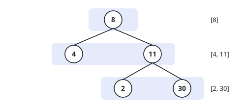

# Group Tree By Depth

## Description

You are given the `root` of a binary tree.

Collect its values grouped by depth: one list for the root's depth, one for
its children, and so on, with the values inside each list read left to
right. Return the resulting list of lists.

### Example 1

```text
Input: root = [8,4,11,null,null,2,30]
Output: [[8],[4,11],[2,30]]
Explanation: The tree is
     8
    / \
   4  11
     /  \
    2    30
```



### Example 2

```text
Input: root = [7,null,4]
Output: [[7],[4]]
Explanation: The left branch is empty; depth 1 holds one value.
```

### Example 3

```text
Input: root = []
Output: []
Explanation: An empty tree has no values to group.
```

### Constraints

- The tree has between `0` and `2000` nodes.
- `-1000 <= Node.val <= 1000`

## Hints

### Hint 1

Values at the same depth are not adjacent in any depth-first walk — but
they are exactly the nodes you meet in a fixed distance order.

### Hint 2

Process the tree in that order with a queue, one depth per round.

### Hint 3

At the start of a round the queue holds precisely one depth's nodes; drain
exactly that many before moving on.

### Hint 4

While draining, enqueue each node's non-null children — they become,
exactly, the next round's contents.
