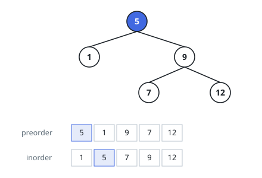

# Rebuild Tree From Two Traversals

## Description

You are given two integer arrays, `preorder` and `inorder`. Each is a
traversal of one and the same binary tree: `preorder` lists every node's
value before its subtrees (node, left subtree, right subtree), and `inorder`
lists the left subtree, then the node, then the right subtree.

Reconstruct that tree and return its root.

### Example 1

```text
Input: preorder = [5,1,9,7,12], inorder = [1,5,7,9,12]
Output: [5,1,9,null,null,7,12]
Explanation: 5 opens the preorder, so it is the root. In the inorder it sits
between 1 and 7,9,12: a one-node left subtree and a three-node right subtree
whose own preorder 9,7,12 makes 9 the right child with leaves 7 and 12.
```



### Example 2

```text
Input: preorder = [6], inorder = [6]
Output: [6]
Explanation: A single value in both orders can only be a lone root.
```

### Constraints

- `1 <= preorder.length <= 3000`
- `inorder.length == preorder.length`
- `-3000 <= preorder[i], inorder[i] <= 3000`
- all values in the two arrays are unique
- the two arrays are consistent traversals of one tree

## Hints

### Hint 1

Whatever subtree you are currently rebuilding, its root is the next
unconsumed value of `preorder` — and where that value sits in `inorder`
separates the left subtree's values from the right's.

### Hint 2

Scanning `inorder` for that position each time costs a linear search; a map
from value to position makes the split instantaneous.

### Hint 3

Rather than cutting `preorder` into slices, keep one shared cursor that the
recursion advances — the root values are requested in exactly `preorder`
order.
