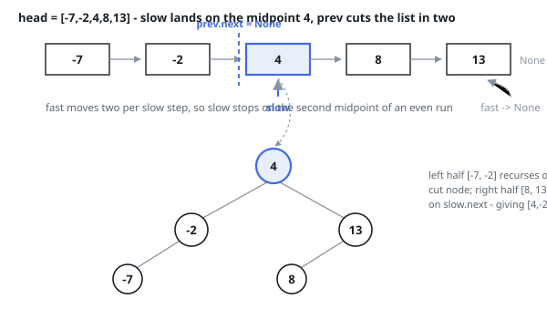

# Solutions — Balanced Tree From Sorted List

Two builds with one outcome. Each roots every segment at its midpoint —
second of the two middles when the count is even — so both deliver the very
same height-balanced tree; they part ways only in how the midpoint is found.

## Fast/slow

Inside a sorted segment, the midpoint is the one root choice that leaves
both sides search-ordered and as equal in size as the node count permits,
so recursing on the halves around it produces the balanced tree: nodes on
one side hang below as the left subtree, nodes on the other as the right.

Because the input is a singly linked list, the midpoint is located by a
pointer race: `slow` advances a single node per step, `fast` double that,
and by the time `fast` has run off the end, `slow` is parked on the
midpoint. Guarding the loop with `fast and fast.next` is what selects the
second of the two middles for even lengths, i.e. the required tie-break.
`prev` trails `slow` by one so that `prev.next = None` severs the segment;
the recursion then proceeds with `node` and `slow.next` as two independent
heads.

A missing segment (`node is None`) yields `None`, and a lone node is turned
into a leaf before the walk begins — a necessary ordering, since with one
node `prev` would still be `None` at the moment of the cut. (The Rust port
first flattens the list into an array and runs the same two-pointer walk on
indices — safe Rust cannot carry the aliasing pointers the list walk
needs.)

**Complexity:** `O(n log n)` time, `O(log n)` space — each call walks its
entire segment (`T(n) = 2T(n/2) + Θ(n)`), and the recursion depth is the
height of the balanced result, with the cuts reusing the input nodes in
place.

## Inorder simulation

Read in order, a sorted list is already the inorder sequence of the target
tree, so the tree can be filled in exactly that order: a cursor sweeps the
list once while the recursion claims nodes at the spots an inorder walk
would visit them. For a segment of n nodes the left subtree claims the
first ⌊n / 2⌋, the next node in line becomes the root, and the remainder
falls to the right subtree — the very same middles the pointer race picks,
and therefore the very same tree.

A counting pass measures the list first, since the recursion needs each
subtree's size to know where its root falls; then one recursive build
spends the list: descend left, take the cursor's node as the root and step
the cursor, descend right. Nodes are claimed once and never revisited, so
nothing is rescanned the way the midpoint walk rescans.

**Complexity:** `O(n)` time, `O(log n)` space for the recursion depth —
the height of the tree being grown.
