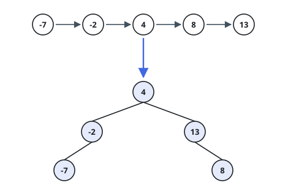

# Balanced Tree From Sorted List

## Description

You are given the `head` of a singly linked list whose values appear in
ascending order. Rebuild it as a binary search tree in which the depths of
any two leaves differ by at most one, and return the new root.

The build must be deterministic: for each sorted segment, the root of its
subtree is the middle node — of two middle nodes in an even-length segment,
take the **second**. The nodes before the middle become the left subtree,
the nodes after it the right subtree.

### Example 1

```text
Input: head = [-7,-2,4,8,13]
Output: [4,-2,13,-7,null,8]
Explanation: 4 is the middle of the five values. The left segment [-7,-2]
takes -2 as root (second of two middles) with -7 under it; the right
segment [8,13] takes 13 as root with 8 under it.
```



### Example 2

```text
Input: head = []
Output: []
Explanation: An empty list becomes an empty tree.
```

### Constraints

- The list has between `0` and `2 * 10^4` nodes.
- `-10^5 <= Node.val <= 10^5`

## Hints

### Hint 1

In a sorted segment the midpoint is the root that keeps both sides as
close in size as the counts allow — so the balanced tree comes out of
recursing on the two halves around it.

### Hint 2

A singly linked list has no random access, but two pointers find the
midpoint in one walk: one steps a node at a time, the other two.

### Hint 3

For the required tie-break, the loop must leave the stepping pointer on
the second of two middles when the segment length is even.

### Hint 4

Trailing the midpoint pointer with a third pointer lets you sever the list
so each half can be rebuilt on its own.
