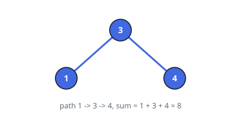
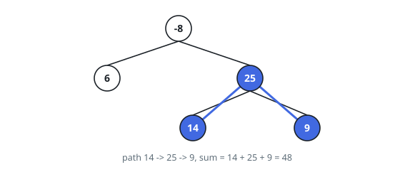

# Best Tree Path Sum

## Description

A **path** through a binary tree picks up a chain of nodes in which every
consecutive pair is joined by an edge, and no node is used twice. The path may
start anywhere, end anywhere, and does not have to visit the root; it may
descend through a node and continue into the other side, which is what lets a
path bend where two branches meet.

The **sum** of a path is the total of the values on it. Given the `root` of a
binary tree, return the largest sum achieved by any non-empty path.

### Example 1

```text
Input: root = [3,1,4]
Output: 8
Explanation: The path 1 -> 3 -> 4 passes through the root and takes in every
node, for 1 + 3 + 4 = 8.
```



### Example 2

```text
Input: root = [-8,6,25,null,null,14,9]
Output: 48
Explanation: The best path is 14 -> 25 -> 9, entirely inside the right
subtree, for 48. Adding the root at -8 would only drag the total down.
```



### Example 3

```text
Input: root = [-3]
Output: -3
Explanation: The path must hold at least one node, and the only node is -3,
so the answer is negative.
```

### Constraints

- The tree has between `1` and `3 * 10^4` nodes.
- `-1000 <= Node.val <= 1000`

## Hints

### Hint 1

Every path has a unique highest node — the point where it turns, if it turns.
Split the problem by that node: what does a path turning at `v` look like?

### Hint 2

It is `v` plus something descending from `v` into the left, plus something
descending into the right — either of which may be empty. So for each node,
compute the best sum of a downward path that *starts* at it and uses at most
one child.

### Hint 3

A downward path with a negative total should never be joined: clamp it away.
Then a node's turn candidate is its value plus the two clamped gains, and what
it hands to its parent is its value plus the larger gain alone — a parent
cannot extend into both sides at once.

### Hint 4

While the recursion returns single-side gains upward, remember the best turn
candidate seen anywhere; the answer is that remembered value, not whatever the
root returns.
