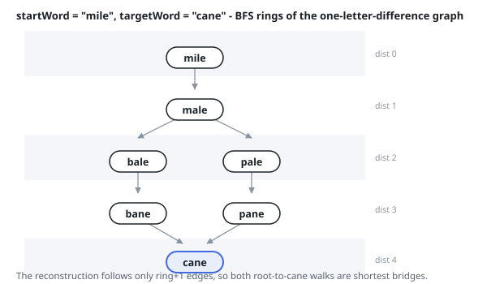

# Solutions — All Shortest Word Bridges

## Sweep Distances, then Walk the Surviving Edges

The dictionary again describes an implicit graph — words as vertices, edges
between neighbours — and a bridge is a route through it. One outward sweep
from `startWord` fixes every reachable word's distance, and while it runs it
also prunes the edge set: an edge out of `word` is recorded only when it lands
on a word one step further out, either because the sweep is discovering that
word for the first time or because a parallel word of the same ring reaches it
a moment later. Edges joining words of one ring, and edges pointing back
toward the start, can never sit on a minimum bridge, so dropping them leaves a
layered graph holding exactly the routes that matter.

Neighbours are produced by substituting each of the 25 other letters at each
position and testing the result against a hash set — affordable here because
words are at most five letters and the dictionary at most 500 words.
`startWord` is removed from that set so the sweep can never turn back through
it, and when `targetWord` is absent from the dictionary the answer is empty
before any search begins.

The second half is a plain walk from the start over the recorded edges. Every
recorded edge advances exactly one ring, so any route that reaches
`targetWord` has minimum length by construction — nothing is found then
discarded. Each arrival appends a copy of the current route, and one shared
buffer is extended and trimmed as the walk advances and retreats. On the first
example the sweep assigns bale and pale to ring 2, bane and pane to ring 3,
and the walk returns two routes through that layered graph, the b-side and the
p-side.

With `N` dictionary words of `L` letters, `K` minimum bridges of `D` words
each: the sweep generates at most `26 · N · L²` candidate strings, and the
walk costs the size of its own output.

**Complexity:** `O(26 · N · L² + K · D)` time, `O(N · L + K · D)` space.
