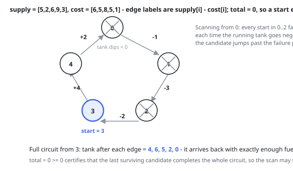

# Solutions — Circular Route Start

## Greedy Single Pass with Tank Reset

Each stop contributes one number that matters, `diff = supply[i] - cost[i]`, and
the ring as a whole is affordable exactly when those numbers add up to something
non-negative. That gives the `-1` test for free: accumulate `total` while
scanning, and if it ends up below zero, no starting index can survive the round
trip. Otherwise a start exists, and the problem promises it is the only one.

Finding it takes the same pass. Alongside `total`, keep `tank`, the balance
accumulated since the current candidate `start`. When `tank` slips under zero
at index `i`, the candidate is wrong — but so is every index between `start` and
`i`. Any of them would have reached `i` without the balance the candidate had
banked on the way, and that balance was non-negative at every point before the
slip, so they arrive with no more fuel and fail no later. The whole stretch dies
at once, and the pass sets `start = i + 1` with `tank` back to zero.

Why the last surviving candidate is correct, without re-verifying it: everything
before it has been ruled out, and `total >= 0` says some index does work.

Edge behaviour falls out of the same two variables. A one-stop ring answers `0`
when its single difference is non-negative and `-1` otherwise, and an infeasible
input always ends with a negative `total`, which overrides whatever candidate
the sweep happened to be holding.

**Complexity:** `O(n)` time, `O(1)` space.
