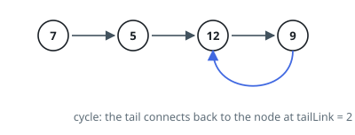
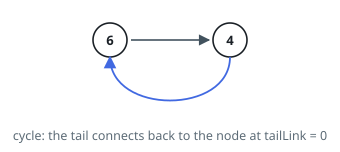
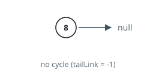

# Cycle Detection In A List

## Description

A singly linked chain of nodes contains a cycle when following outgoing links
from the front eventually returns you to a node you have already stood on.
Decide whether the chain you are given contains one.

The judge cannot hand you node objects, so the chain arrives flattened into two
arguments: `values` lists the node values front to back, and `tailLink` is the
index of the node that the final node's outgoing link points at, or `-1` when
the final node points at nothing. Build the chain from `values`, attach that
closing link when `tailLink` is not `-1`, and then answer for the chain you
built.

Return `true` when the chain contains a cycle and `false` otherwise.

### Example 1

```text
Input: values = [7,5,12,9], tailLink = 2
Output: true
Explanation: The last node links back to the node holding 12, so walking
forward from 7 you circle between 12 and 9 forever.
```



### Example 2

```text
Input: values = [6,4], tailLink = 0
Output: true
Explanation: The last node links back to the front, so the two nodes form
the whole cycle.
```



### Example 3

```text
Input: values = [8], tailLink = -1
Output: false
Explanation: The single node points at nothing, so the walk ends.
```



### Constraints

- `values` holds between `0` and `10⁴` node values.
- Each value lies between `-10⁵` and `10⁵` inclusive.
- `tailLink` is `-1`, or an index that exists in `values`.

### Follow-up

Detection can be done without remembering the nodes you have visited. Can you
find a method whose extra memory does not grow with the chain?

## Hints

### Hint 1

Build the nodes first, wire them front to back, and only then attach the final
node's link to the index `tailLink` names. Everything after that is a question
about the chain, not about the arguments.

### Hint 2

The obvious method writes down every node it stands on and stops when it stands
on one twice. Identity, not value, is what must be recorded — two nodes may
hold the same number.

### Hint 3

For the constant-memory version, run two walkers from the front at different
speeds, one node per step against two.

### Hint 4

If the faster walker reaches the end, the chain terminates and no cycle exists.
If it does not, both walkers are circling, and since the faster gains exactly
one node per step it cannot jump over the slower — they must land together
inside one lap.
