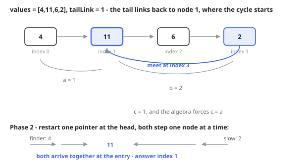

# Solutions — Cycle Entry In A List

As in the detection-only sibling, the arguments are not yet a chain, so both
ports build it first: one node per entry of `values`, wired front to back, with
the final node's link attached to the index `tailLink` names when that is not
`-1`. Empty input answers `-1` immediately. And because the answer is a
position rather than a node, both detectors finish the same way — having
identified the entry node, they walk from the front counting steps until they
reach it.

## Floyd

The first phase is the two-speed walk: one walker advancing a node per step,
the other two. If the fast walker runs out of chain there is no cycle and the
answer is `-1`. Otherwise the two land on the same node somewhere inside the
loop, and that landing point — not the entry — is what the first phase hands
over.

It is enough, because the landing point is determined by the entry. Call `a`
the distance from the front to the entry, `b` the distance from the entry
onward to the landing node, and `c` the remainder of the lap that closes back
to the entry. The slow walker has travelled `a + b`; the fast walker has
travelled exactly twice that, and its route is the same `a + b` plus some whole
number of laps. Taking the simplest case of one extra lap, `a + 2b + c` equals
`2(a + b)`, and everything cancels down to `c = a`. The distance from the
landing point round to the entry is the same as the distance from the front to
the entry.

That is the second phase: put one walker back at the front, leave the other on
the landing node, and advance both a single node at a time. After exactly `a`
steps they are on the entry together. The code then counts its way from the
front to that node to produce the position the judge wants. All three phases
are linear, and none of them stores anything — the only sizeable memory is the
node array the argument format forces, so the detection proper meets the
follow-up's constant-memory bound.

**Complexity:** `O(n)` time, `O(n)` space — the construction; the detection
itself is `O(1)`.

## Hash set

Walk forward from the front, putting every node you stand on into a set keyed
by identity rather than value. Running off the end means no cycle and the
answer is `-1`. Otherwise the first node you find already in the set is the
entry, and that is worth being precise about: a node before the entry is passed
once and never reached again, since nothing links back to it, so it can never
be the first repeat. The entry is passed on the way in and met again as soon as
the first lap closes, which makes it the earliest node the walk can see twice.

With the entry node in hand, a short walk from the front counts the positions
up to it. No distance algebra is needed here at all — the whole argument is
"which node do I see twice first?" — and the price for that clarity is the set,
`O(n)` memory, exactly what the follow-up asks you to do without.

**Complexity:** `O(n)` time, `O(n)` space.
