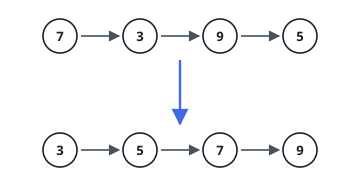
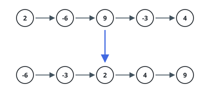

# Order Linked List

## Description

You are given `head`, the first node of a singly linked list. Rearrange the
list so that its values run from smallest to largest, and return the head of
the rearranged list.

### Example 1

```text
Input: head = [7,3,9,5]
Output: [3,5,7,9]
```



### Example 2

```text
Input: head = [2,-6,9,-3,4]
Output: [-6,-3,2,4,9]
```



### Example 3

```text
Input: head = []
Output: []
```

### Constraints

- the list holds `0` to `5 * 10⁴` nodes
- each node's value is between `-10⁵` and `10⁵`

### Follow-up

`O(n log n)` time is the target. Can you also hold the extra memory to a
constant, with no recursion stack to pay for?

## Hints

### Hint 1

A linked list gives you no indexing, so the sorts that jump around an array are
awkward here. The one that never needs to jump — divide the sequence, sort each
piece, then interleave the two sorted pieces — translates directly.

### Hint 2

To cut the list in two without knowing its length, advance one cursor a node at
a time and another two at a time. Let the fast cursor begin one node in front,
and the slow one lands on the last node of the first half, which is exactly
where the cut belongs — and which guarantees both halves shrink, even at length
two.

### Hint 3

Interleaving two ordered lists needs no new nodes: keep a placeholder node in
front of the result, repeatedly detach whichever head is smaller and append it,
then attach whatever remains when one side empties.
