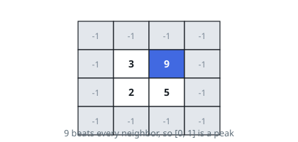
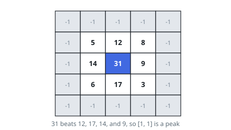

# Peak in a Matrix

## Description

In a 2D grid of integers, a **peak** is a cell whose value is strictly
greater than each of its four neighbors — the cells immediately above,
below, left, and right.

You are given a 0-indexed `m x n` integer matrix `mat` in which no two
adjacent cells hold equal values. Locate a peak and return its position
as the length-2 array `[i, j]`.

Treat the matrix as ringed by an outer border of cells holding `-1`, so
edge and corner cells have neighbors on every side.

The judge's matrices are built to contain exactly one peak, which makes
the expected answer unique, even though several peaks are possible in
general.

Your algorithm must run in `O(m log(n))` or `O(n log(m))` time.

### Example 1

```text
Input: mat = [[3,9],[2,5]]
Output: [0,1]
Explanation: 9 stands above 3 on its left and 5 below; above it and to its
right are border cells worth -1. So [0,1] is the peak.
```



### Example 2

```text
Input: mat = [[5,12,8],[14,31,9],[6,17,3]]
Output: [1,1]
Explanation: 31 exceeds 12 above it, 17 below, 14 to the left, and 9 to
the right, so [1,1] is the peak.
```



### Constraints

- `m == mat.length`
- `n == mat[i].length`
- `1 <= m, n <= 500`
- `1 <= mat[i][j] <= 10^5`
- Adjacent cells never hold equal values.

## Hints

### Hint 1

Cut the matrix at a middle row and scan that row for its largest entry.

### Hint 2

The row maximum already outranks its horizontal neighbors, so only the
vertical comparison can rule it out — check the cells just above and
below it.

### Hint 3

If one of those vertical neighbors is larger, keep the half containing it
(the middle row included) and repeat; a maximality argument shows that
half still contains a peak of the full matrix.
