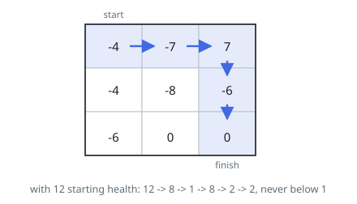

# Minimum Start Health

## Description

A walk crosses an `m x n` grid of rooms, beginning in the top-left room and
ending in the bottom-right, moving one room at a time to the right or
downward — never left, never up.

Each room holds an integer. Entering it adds that integer to a running total:
a negative room takes away, a positive room gives back, and a room holding
`0` changes nothing. The total starts at some starting value `H` of your
choosing, and the walk only counts if the total stays at `1` or above after
every room entered, the first and last included.

Return the smallest `H` for which some legal walk gets across.

### Example 1

```text
Input: grid = [[-4,-7,7],[-4,-8,-6],[-6,0,0]]
Output: 12
Explanation: Starting at 12 and walking right, right, down, down, the running
total goes 12, 8, 1, 8, 2, 2 — it touches 1 but never drops under it. No
smaller start survives any walk.
```



### Example 2

```text
Input: grid = [[-4]]
Output: 5
Explanation: The only walk enters the single room, so the start must cover its
whole cost and still leave 1: 5 - 4 = 1.
```

### Example 3

```text
Input: grid = [[3,0],[2,5]]
Output: 1
Explanation: Every room gives back or costs nothing, so even the smallest
possible start — 1 — never falls.
```

### Constraints

- `grid` has between `1` and `200` rows and between `1` and `200` columns
- every room holds an integer in `[-1000, 1000]`

## Hints

### Hint 1

A forward plan is hard to pin down: a generous room deep in the grid can make
it worth absorbing heavy losses early, so "keep the total high" is not a rule
you can apply step by step. Ask instead what each room demands of the start.

### Hint 2

Work from the bottom-right corner backwards. For a room, the cheapest
continuation is the less demanding of the two rooms after it, and entering
this room must leave you with that much plus one for the room's own effect —
and never less than 1.

### Hint 3

The corner itself needs a starting point: leaving it costs nothing more, but
the total must still be at least 1 on the way out. Fill the table row by row
upwards; the top-left entry is the answer.
