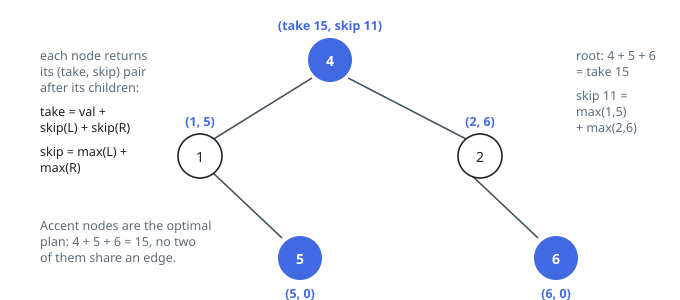

# Solutions — Non-Adjacent Loot in a Tree

## Post-order tree DP with take/skip pairs

The rule binds a node only to its parent and its children, so each subtree carries a self-contained answer described by two numbers: the best total when the subtree's root is taken, and the best when it is left out. A parent's pair is assembled from its children's pairs and nothing else, which is why one bottom-up traversal computes them all without any shared state.

The recurrence is immediate. Taking a node rules out taking either child, so `take_here = node.val + left_skip + right_skip`. Leaving a node out frees each child to pursue whichever of its own two options is larger, so `skip_here = max(left_take, left_skip) + max(right_take, right_skip)`. An empty subtree returns the pair `(0, 0)`, and the answer is the larger of the root's two numbers.

Returning the pair is what keeps this linear. A formulation that asks each child separately for "the best plan among the grandchildren" and "the best plan excluding this node" walks the same subtree twice, and that doubling compounds at every level into exponential work; carrying both values in one return evaluates every subtree exactly once.

Concretely, for the tree `[4,1,2,null,5,null,6]`: both leaves report `(5, 0)` and `(6, 0)`. The node holding 1 sits above the leaf 5, so taking it yields `1 + 0 = 1` while skipping it yields `max(5, 0) = 5`, giving the pair `(1, 5)`; by the same arithmetic the node holding 2 gives `(2, 6)`. The root then takes `4 + 5 + 6 = 15` versus skipping for `max(1, 5) + max(2, 6) = 11`, so 15 is the answer.

The base case and the `max` wrappers absorb the edge shapes: a one-node tree returns its own value, zeros never distort the choice, and a tree degenerating into a chain merely deepens the recursion — with at most 10⁴ nodes the stack is bounded by the tree height, O(n) in the worst case.

**Complexity:** `O(n)` time, `O(h)` space for the recursion stack (where `h` is the tree height).
