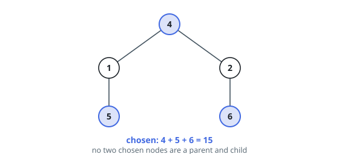
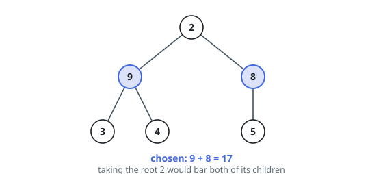

# Non-Adjacent Loot in a Tree

## Description

You are given the `root` of a binary tree in which every node holds a
value. Choose a set of nodes in which no node's parent is also chosen,
and return the largest total the chosen values can reach.

Choosing nothing is allowed, so the answer is never negative.

### Example 1

```text
Input: root = [4,1,2,null,5,null,6]
Output: 15
Explanation: The root 4 and the two leaves 5 and 6 are the chosen set;
no two of them are a parent and child, so all three count: 4 + 5 + 6 = 15.
```



### Example 2

```text
Input: root = [2,9,8,3,4,null,5]
Output: 17
Explanation: 9 and 8 are the root's children, and they are not adjacent to
each other, so both count: 9 + 8 = 17. Taking the root 2 instead would bar
both children and cap the total at 14.
```



### Constraints

- The tree holds between `1` and `10⁴` nodes.
- Every value is an integer from `0` to `10⁴` inclusive.

## Hints

### Hint 1

The rule ties each node only to its parent and to its children, so a
subtree's optimum is settled entirely by the optima of the smaller
subtrees inside it — work from the leaves upward.

### Hint 2

Keep two numbers per subtree: the best total when its root is taken, and
the best when its root is left out. Taking a node bars its children but
leaves every grandchild available.

### Hint 3

Both numbers for a node follow from the two pairs beneath it, so one
post-order pass computes every pair; the answer is the larger of the two
at the root, in O(n) time overall.
