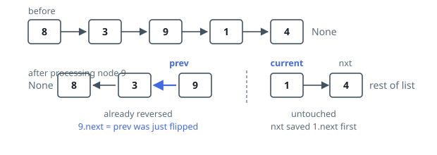

# Solutions — Reverse Whole List

Nothing has to be built here. The nodes handed in are already the nodes of the
answer; what changes is which way each outgoing link points. Both approaches
below repaint those links, touching every node once and allocating no new ones.
They part company only over who remembers the node behind — a variable, or a
suspended call.

## Iterative

Carry the frontier in three references. `prev` is the front of the portion
already turned around, empty to begin with; `current` is the node whose link is
about to be repainted; `nxt` is scratch space holding the route onward.

The order of the four statements inside the loop is the whole trick. Writing
`current.next = prev` overwrites the only reference to everything downstream,
so `nxt = current.next` has to run first — after that the remainder is safely
in hand and the link can be repainted freely. Then `prev` slides onto the node
just finished and `current` onto the saved successor. What holds at the top of
every pass: behind `prev` every link already points backwards, ahead of
`current` no link has been disturbed.

The loop stops when `current` runs off the end, and at that instant `prev` is
sitting on what used to be the final node — which is exactly the front of the
answer. On `[8,3,9,1,4]` the sweep leaves `prev` on `4`, whose chain reads
`4 -> 1 -> 9 -> 3 -> 8`. An empty chain skips the loop entirely and returns
nothing, and a lone node has its link written to the empty value it already
held.

**Complexity:** `O(n)` time, `O(1)` space.

## Recursive

Settle the tail, then hang the front off the back of it. A missing node or a
final node is its own answer and stops the descent. Otherwise the call on
`head.next` comes back with the front of the settled remainder, and two writes
finish this node's share of the work: `head.next.next = head` makes the node
immediately downstream point back at `head`, and `head.next = None` cuts
`head`'s own outgoing link so it becomes the final node. That returned front is
passed straight back up, unchanged, from the deepest call to the shallowest —
on `[6,2]` the descent bottoms out on `2`, which becomes the answer's front,
and the unwinding step points `2` at `6` and clears `6`'s link.

Each node is still handled once and nothing is allocated, but a frame is pushed
per node, and that is precisely the cost the loop version declines to pay. The
ports each bend to their runtime: Python lifts the interpreter's frame ceiling,
because 5000 nodes overshoot CPython's default; Rust threads the settled prefix
downwards as an extra argument, since the ordinary link-back needs two live
handles on one node and the borrow checker will not grant them; and the
JavaScript and TypeScript judges cap frames below 5000, so those two ports cut
the chain in half instead, settle each half, and splice them in swapped order —
a logarithmic depth bought with `O(n log n)` walking.

**Complexity:** `O(n)` time, `O(n)` space for the frames — the JS/TS ports trade
down to `O(log n)` depth at `O(n log n)` time.
