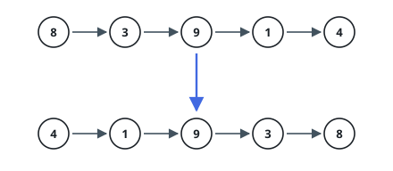
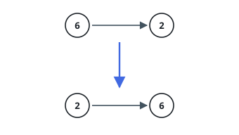

# Reverse Whole List

## Description

You are given `head`, the first node of a singly linked chain. Turn the chain
around so that the node that used to sit last comes first and every link points
the other way, and return the front of the result.

The chain may be empty.

### Example 1

```text
Input: head = [8,3,9,1,4]
Output: [4,1,9,3,8]
```



### Example 2

```text
Input: head = [6,2]
Output: [2,6]
```



### Example 3

```text
Input: head = []
Output: []
Explanation: An empty chain has nothing to turn around.
```

### Constraints

- The chain holds between `0` and `5000` nodes.
- Every stored value lies between `-5000` and `5000` inclusive.

### Follow-up

There is a loop-driven answer and a self-calling one. Can you produce both, and
say where their memory costs part company?

## Hints

### Hint 1

Nothing needs to be allocated: the answer reuses the very nodes you were
handed, with their outgoing links repainted.

### Hint 2

Repainting one link destroys the only route to the remainder of the chain, so
capture that route in a variable before you overwrite anything.

### Hint 3

Sweeping forward, carry the node behind you: the link you write at each stop
points back at it, and when you fall off the end, that carried node is the
front of the answer.

### Hint 4

The self-calling version inverts the order of work — settle the chain past the
first node, then make the node immediately after the front point at the front
and cut the front's own outgoing link.
