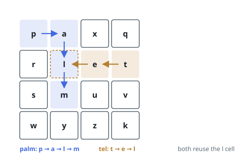

# Solutions — Find Grid Words

## Trie-Guided Backtracking

One grid DFS per word cannot survive a list of 3 × 10^4 words — but the
words overlap in their beginnings, so the method builds a single trie over
all of them and explores the grid _through_ it. A DFS from any cell walks
trie edges in step with grid moves; when a cell's letter is not a child of
the current node, every word living under that prefix is eliminated
together. That shared-prefix pruning is the whole source of speedup over
per-word searching.

The trie is nested dictionaries, with a `"#"` entry at each terminal
holding the finished word, so it can be collected without reassembling it
letter by letter. A `seen` grid flags cells that lie on the active path (a
cell serves at most once _within_ one word) and clears the flag on the way
back out, leaving the cell free for other paths and other words. Each time
the walk lands on a `"#"` marker the stored word joins a `found` set, which
absorbs duplicates when a word is traceable along more than one route.

The outer double loop launches a DFS from every cell, a word being free to
start anywhere, and cells whose letter is missing from the trie root drop
out at once. `sorted(found)` gives deterministic output. Building the trie
costs one sweep over all characters; after the first move each DFS branch
has at most 3 continuations (the cell just came from is flagged), so for a
grid of M × N and words of length at most L the classic `M·N·3^L` search
bound applies.

**Complexity:** `O(W·L + M·N·3^L)` time, `O(W·L)` space.
