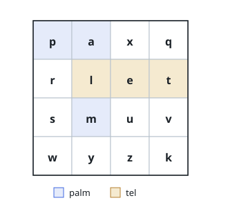

# Find Grid Words

## Description

You are given an `m x n` grid `board` of letters and a list `words`. Return
every word from the list that can be traced on the grid, in any order.

A word is traced by stepping from cell to neighboring cell — up, down, left,
or right — collecting one letter per cell, in order. No cell may be visited
twice while tracing a single word.

### Example 1

```text
Input: board = [["p","a","x","q"],["r","l","e","t"],["s","m","u","v"],["w","y","z","k"]],
words = ["palm","tel","sale","quip"]
Output: ["palm","tel"]
Explanation: palm steps p → a → l → m — across the top row, then down
column 1; tel runs t → e → l backwards along row 1. Neither sale nor quip
can be traced.
```



### Example 2

```text
Input: board = [["c","d"],["e","f"]], words = ["cdffc"]
Output: []
Explanation: Tracing cdffc would have to stand on the only f cell twice,
which the rules forbid.
```

### Constraints

- `m == board.length`
- `n == board[i].length`
- `1 <= m, n <= 12`
- Every cell of `board` holds a lowercase English letter.
- `1 <= words.length <= 3 * 10^4`
- `1 <= words[i].length <= 10`
- Every word in `words` consists of lowercase English letters.
- The words are unique.

## Hints

### Hint 1

With up to 3 × 10⁴ words, searching the grid once per word is too slow.
What do the words have in common that a search could share?

### Hint 2

Cut a search short the instant the letters so far match no word's prefix.
What structure answers "is this string a prefix of some word?" quickly —
and why is a plain hash table of full words not enough?

### Hint 3

A trie over all words lets the grid walk and the word walk advance
together; a dead end in the trie abandons every word behind that prefix at
once.
