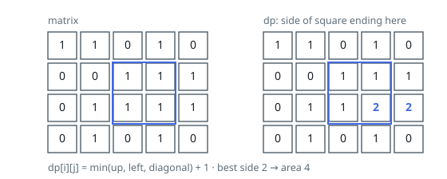

# Solutions — Largest Ones Square

## Dynamic Programming with a Rolling Row

Fix the anchor first: `dp[i][j]` is the side length of the biggest all-ones
square whose bottom-right corner sits on cell `(i, j)`. Every square has
exactly one such corner, so the largest `dp` value anywhere is the largest
square in the grid, and its square is the area to return.

A `'0'` cell ends no square and scores `0`. A `'1'` cell can be the corner of
a square of side `s` only when the three cells that a slightly smaller square
would end on — the one above, the one to the left, and the one diagonally
up-left — each end a square of side at least `s - 1`. All three are needed at
once, so the smallest of the three is the binding one, giving
`dp[i][j] = min(up, left, diagonal) + 1`.

Why the minimum is right rather than, say, the average: a square growing out
of this corner must fit inside the squares its three neighbours describe —
miss any one of them and some cell of the would-be square is a `'0'`. In the
example, the `'1'` at row 1, column 2 is capped at 1 by the `'0'` directly
above it, and its neighbour at column 3 by the `'0'` diagonally up-left; a row
later, column 3 finally sees three adequate neighbours — 1 above, 1 to the
left, 1 diagonally — and scores 2, which is where the answer comes from.

The implementation never stores the whole table. Filling row by row, left to
right, a cell reads only the row above and the entry it just wrote, so two
rows suffice — `prev` for the finished row and `curr` for the one in progress,
each with a leading zero standing in for the off-grid left edge, so first
column and first row need no special cases. `best` tracks the maximum side as
cells are filled and `best * best` is returned; a grid of all zeros never
raises `best` above zero, and `[["1","0"],["0","1"]]` never raises it above
one, since neither one has a neighbour square to grow from.

**Complexity:** `O(mn)` time, `O(n)` space.
