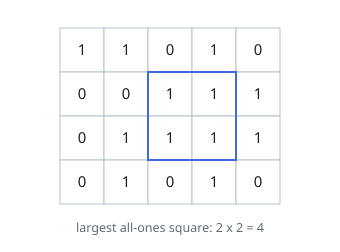
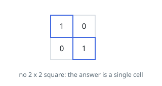

# Largest Ones Square

## Description

You are given an `m x n` grid whose cells each hold the character `'1'` or
`'0'`. Somewhere in it may sit square blocks of cells that all hold `'1'` —
aligned with the grid, one character wide at the smallest, larger at best.

Return the area of the largest such square. A grid with no `'1'` at all has
the answer `0`.

### Example 1

```text
Input: grid = [["1","1","0","1","0"],["0","0","1","1","1"],["0","1","1","1","1"],["0","1","0","1","0"]]
Output: 4
Explanation: A 2 by 2 block of ones occupies rows 1-2 and columns 2-3. Three
of its cells can extend no further, and the fourth is blocked by the zero
above it, so nothing reaches 3 by 3.
```



### Example 2

```text
Input: grid = [["1","0"],["0","1"]]
Output: 1
Explanation: The two ones meet only at a corner, and a square needs whole
sides, so each stands alone.
```



### Example 3

```text
Input: grid = [["0","0"],["0","0"]]
Output: 0
Explanation: No cell holds a one, so no square exists.
```

### Constraints

- the grid has between `1` and `300` rows, each between `1` and `300` cells
- every cell holds `'0'` or `'1'`

## Hints

### Hint 1

Pin the question to a single cell: among the squares of ones whose
lower-right cell lies on it, how wide is the widest? Every square names one
such cell, so the widest over all cells is the answer.

### Hint 2

A square of side `s` ending at a cell implies squares of side at least `s - 1`
ending directly above, directly left, and diagonally up-left. The weakest of
those three is what limits the growth.

### Hint 3

That is a recurrence over cells you have already visited, so one pass fills
it — and only the previous row is ever read, so a couple of rows of storage
are enough.
