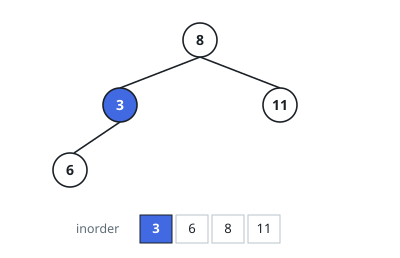
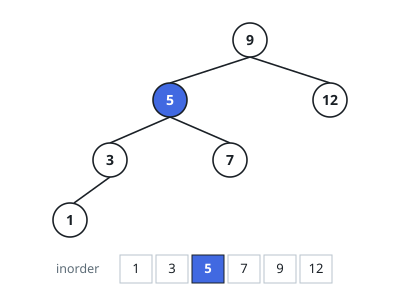

# Select Kth Smallest In A Search Tree

## Description

You are given `root`, the top node of a binary search tree — every node's
left subtree holds only smaller values, its right subtree only larger — and an
integer `k`.

List the tree's values from smallest to largest and return the one in position
`k`, counting from `1`.

### Example 1

```text
Input: root = [8,3,11,null,6], k = 1
Output: 3
Explanation: 3 is the smallest value in the tree: the walk down the left
edges finds it in two steps.
```



### Example 2

```text
Input: root = [9,5,12,3,7,null,null,1], k = 3
Output: 5
Explanation: The sorted order is 1, 3, 5, 7, 9, 12, so the third smallest is 5.
```



### Example 3

```text
Input: root = [2,null,4,null,6,null,8], k = 2
Output: 4
Explanation: Every node has only a right child, so the tree is a chain that
happens to be already sorted.
```

### Constraints

- the tree holds `n` nodes, with `1 <= k <= n <= 10⁴`
- `0 <= Node.val <= 10⁴`

### Follow-up

Suppose the tree changes often — values inserted and removed — and the kth
smallest is wanted again after every change. How would you keep the answers
cheap?

## Hints

### Hint 1

You could collect every value and sort, but the tree already encodes an
order. What single traversal of a search tree emits the values smallest
first?

### Hint 2

Count visits as that traversal runs and stop at the kth — everything the
traversal has not yet reached is larger than what you want.

### Hint 3

For the follow-up, the obstruction is that a node does not know how many
values sit below it. What small piece of bookkeeping at each node would let
you navigate straight to the kth value?

### Hint 4

With that bookkeeping, the ideal cost per query is proportional to the tree's
height, not its size.
