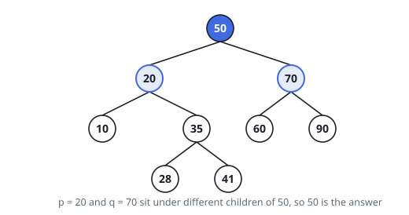
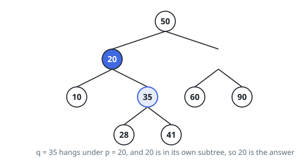

# Deepest Shared Ancestor, Search Tree

## Description

You are given the `root` of a binary search tree and two node values `p` and
`q`. Among the nodes whose subtree contains both of them, return the value of
the one furthest from the root.

A subtree includes its own root, so if one of the two nodes sits above the
other, that upper node is the answer.

The search-tree ordering holds throughout: a node's left subtree stores only
values below the node, and its right subtree only values above it.

### Example 1

```text
Input: root = [50,20,70,10,35,60,90,null,null,28,41], p = 20, q = 70
Output: 50
Explanation: 20 hangs off the left of 50 and 70 off the right, so nothing
below 50 can hold them both.
```



### Example 2

```text
Input: root = [50,20,70,10,35,60,90,null,null,28,41], p = 20, q = 35
Output: 20
Explanation: 35 lies inside the subtree hanging under 20, and 20 belongs to
that subtree as well, so 20 answers for both.
```



### Example 3

```text
Input: root = [14,6,21,3,9,17,28], p = 17, q = 28
Output: 21
Explanation: Both values live under 21, and they part ways there — one to its
left, one to its right.
```

### Constraints

- The tree holds at least `2` and at most `10^5` nodes.
- Every node value lies between `-10^9` and `10^9`.
- No two nodes carry the same value.
- `p` and `q` differ, and each is the value of some node in the tree.

## Hints

### Hint 1

The ordering tells you, from a single comparison, which side of a node a
target value has to be on. You never have to look inside a subtree to rule it
out.

### Hint 2

Start at the root. While both targets compare the same way against the current
node, the node you want is deeper on that one side — the current node still
holds both, but so does its child on that side.

### Hint 3

The descent stops the moment the two targets stop agreeing, or the moment the
current node is one of them. No stack and no second pass are needed.
