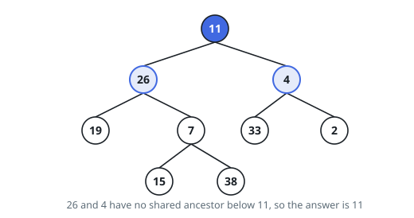
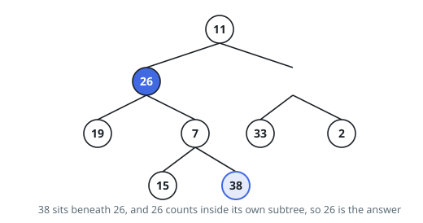

# Deepest Shared Ancestor, Binary Tree

## Description

You are given the `root` of a binary tree and two node values `p` and `q`.
Among the nodes whose subtree contains both of them, return the value of the
one furthest from the root.

A subtree includes its own root, so if one of the two nodes sits above the
other, that upper node is the answer.

No ordering is assumed between a node's value and the values beneath it.

### Example 1

```text
Input: root = [11,26,4,19,7,33,2,null,null,15,38], p = 26, q = 4
Output: 11
Explanation: 26 heads the left branch and 4 the right, so 11 is the first node
that covers both.
```



### Example 2

```text
Input: root = [11,26,4,19,7,33,2,null,null,15,38], p = 26, q = 38
Output: 26
Explanation: 38 is two levels down inside the subtree headed by 26, and 26
belongs to that subtree as well.
```



### Example 3

```text
Input: root = [8,22,5,14,9], p = 14, q = 9
Output: 22
Explanation: 14 and 9 are the two children of 22. The root 8 covers them too,
but it is nearer the top.
```

### Constraints

- The tree holds at least `2` and at most `10^5` nodes.
- Every node value lies between `-10^9` and `10^9`.
- No two nodes carry the same value.
- `p` and `q` differ, and each is the value of some node in the tree.

## Hints

### Hint 1

A node's value implies nothing about what lies beneath it here, so the only
way to learn whether a target is inside a subtree is to look through that
whole subtree.

### Hint 2

Ask each subtree a yes/no question that can be answered bottom-up: does it
hold either target? Let the recursion hand back the target it ran into, and
nothing at all when it ran into neither.

### Hint 3

Then the node you want is the one whose two children hand back different
targets — below it, no single subtree had both. Report a node the instant its
own value is a target, so an ancestor never gets overtaken by its own
descendant.
