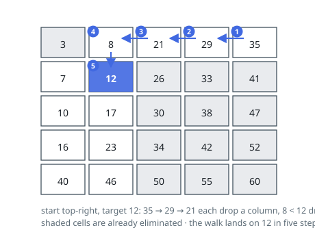

# Solutions — Sorted Matrix Membership

## Staircase Search from the Top-Right Corner

Two independent orderings, one along rows and one down columns, still leave
the matrix unsorted overall, so flattening it and bisecting is not available.
The leverage is at a corner instead. The top-right cell is the maximum of its
row and the minimum of its column at once, which means a single comparison
against it disqualifies an entire line. (Bottom-left works the same way by
symmetry; the other two corners are extremes in both directions at once and
tell you nothing useful.)

Begin there. If the cell is above the target, every cell under it in that
column is larger still, so the column is gone and the walk steps left. If the
cell is below the target, every cell to its left in that row is smaller still,
so the row is gone and the walk steps down. The still-possible region shrinks
by a full row or column each time, and the walk ends either standing on the
target or off the left or bottom edge, which is a proof of absence rather than
a guess.

The route is a monotone staircase of at most `m + n - 1` cells. Against
bisecting all `m` rows at `O(m log n)` it wins on anything close to square. An
empty matrix, or a matrix of empty rows, is rejected before the loop; after
that two index variables are the whole state.

**Complexity:** `O(m + n)` time, `O(1)` space.

## Row-by-Row Binary Search

Forget the columns and what remains is `m` sorted arrays. Each is searchable
in `O(log n)` by the standard two-bound loop: advance `lo` past everything
below the target, pull `hi` down over everything at or above it, and when they
meet, `lo` rests on the leftmost entry that is not smaller than the target — a
single equality test then settles that row.

The column ordering earns its keep at a different point: as a stopping rule.
Rows are visited top to bottom, and a row's first entry lower-bounds every
entry in it and in every row beneath. So the moment a row opens above the
target, no later row can hold it either and the scan quits early. The same
empty-input guards as the staircase variant apply before any of this.

**Complexity:** `O(m log n)` time, `O(1)` space — behind the staircase's
`O(m + n)` for square-ish inputs, ahead of it when the matrix is a handful of
very long rows.
