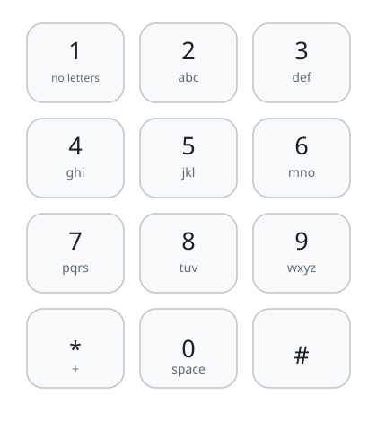

# Keypad Letter Spells

## Description

Classic mobile keypads attach letters to the number keys. Given a string
of digits, every key in it contributes one letter to a spell, and a spell
is any way of choosing one letter per key. Return every spell the digit
string can produce.

The keypad layout is:



```text
2 abc    3 def
4 ghi    5 jkl    6 mno
7 pqrs   8 tuv    9 wxyz
```

Order the output so that the letters of earlier digits vary slowest: all
spells beginning with the first digit's first letter come before those
beginning with its second letter, and so on. An empty digit string
produces no spells at all — the answer for `""` is `[]`, not a list
holding an empty spell.

### Example 1

```text
Input: digits = "59"
Output: ["jw","jx","jy","jz","kw","kx","ky","kz","lw","lx","ly","lz"]
Explanation: Key 5 offers j, k, l and key 9 offers w, x, y, z, so the
twelve spells pair each of the former with each of the latter.
```

### Example 2

```text
Input: digits = "25"
Output: ["aj","ak","al","bj","bk","bl","cj","ck","cl"]
```

### Example 3

```text
Input: digits = ""
Output: []
Explanation: With no keys pressed there is nothing to spell.
```

### Constraints

- `0 <= digits.length <= 4`
- Each character of `digits` is one of `'2'` through `'9'`.
