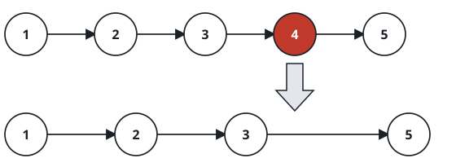

# Drop the Nth Node From the Tail

## Description

You are given the `head` of a singly linked list and an integer `n`.
Counting from the last node backward, unlink the node that sits in
position `n` and return the head of the list that remains.

### Example 1



```text
Input: head = [1,2,3,4,5], n = 2
Output: [1,2,3,5]
Explanation: The second node from the tail — the 4 — is unlinked.
```

### Example 2

```text
Input: head = [8,3,7], n = 3
Output: [3,7]
Explanation: With `n` equal to the list's length, the head itself is
dropped and the next node becomes the new head.
```

### Example 3

```text
Input: head = [9,4,8], n = 2
Output: [9,8]
```

### Constraints

- Let `sz` be the number of nodes in the list.
- `1 <= sz <= 30`
- `0 <= Node.val <= 100`
- `1 <= n <= sz`

### Follow-up

Can you manage it in a single sweep over the list?

## Hints

### Hint 1

Send two runners down the list, keeping the second one `n` nodes behind
the first.
