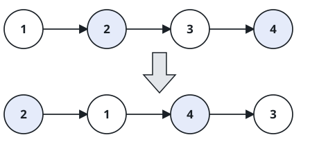

# Pairwise Node Trade

## Description

Walk a linked list two nodes at a time and trade each adjacent pair: the
first node of the pair takes the second's place and vice versa, while the
pairs themselves keep their order along the list. Return the head of the
rewired list.

The nodes must be relinked, not relabeled — you may not fix the order by
writing new values into the nodes; only the pointers may change. A pair
needs two nodes, so if the list ends with a lone node, that node stays
where it is.

### Example 1

```text
Input: head = [1,2,3,4]
Output: [2,1,4,3]
```



### Example 2

```text
Input: head = [7,11,20,4,9]
Output: [11,7,4,20,9]
Explanation: Two full pairs trade places; the trailing 9 has no partner
and stays put.
```

### Example 3

```text
Input: head = [5,5]
Output: [5,5]
Explanation: The only pair trades places, which is invisible in the
values — the pointers, not the values, were rewritten.
```

### Example 4

```text
Input: head = [2,6,1]
Output: [6,2,1]
```

### Constraints

- The list holds between `0` and `100` nodes.
- `0 <= Node.val <= 100`
