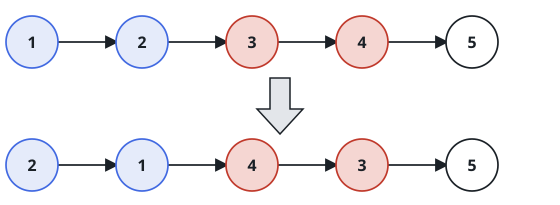
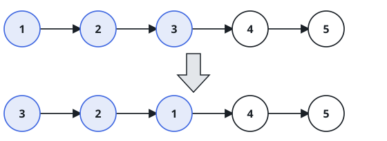

# Reverse in Groups of k

## Description

You are given the `head` of a singly linked list and an integer `k`.
March down the list `k` nodes at a time and reverse every complete
block of `k` in place, then return the head of the rearranged list.

`k` is positive and never larger than the list's length. If the walk
ends on a tail fragment shorter than `k`, that fragment is left in its
original order.

Rearrangement means rewiring, not relabeling: a node must come out of
the process with its `val` untouched — only the `next` links may move.

### Example 1



```text
Input: head = [1,2,3,4,5], k = 2
Output: [2,1,4,3,5]
Explanation: The pairs 1,2 and 3,4 each trade places; the lone 5 has
no partner, so it stays where it is.
```

### Example 2



```text
Input: head = [1,2,3,4,5], k = 3
Output: [3,2,1,4,5]
Explanation: Only the opening three nodes make up a full block; 4 and
5 form a short fragment and survive untouched.
```

### Example 3

```text
Input: head = [6,5,4,3,2,1], k = 4
Output: [3,4,5,6,2,1]
Explanation: The first four nodes flip as one block, and the trailing
pair is too short to reverse.
```

### Constraints

- Let `sz` be the number of nodes in the list.
- `1 <= sz <= 5000`
- `0 <= Node.val <= 1000`
- `1 <= k <= sz`

### Follow-up

Can the whole rearrangement be done with `O(1)` extra memory — no
recursion stack, no side arrays?
