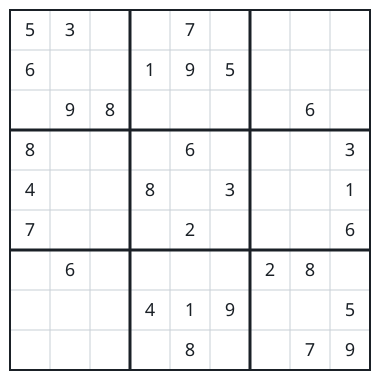

# A Grid Without Clashes

## Description

You are handed a 9 x 9 grid where some cells hold a digit `1`–`9` and the
rest are still empty, written as `"."`. The grid counts as clash-free when
no digit repeats within any unit of these three kinds:

- any single row,
- any single column,
- any of the nine 3 x 3 blocks the grid splits into.

Only the digits actually present are judged — empty cells impose nothing.
A clash-free grid is not required to be completable into a full puzzle;
validity here is purely about the digits already on the grid.

### Example 1



```text
Input: board =
[["5","3",".",".","7",".",".",".","."]
,["6",".",".","1","9","5",".",".","."]
,[".","9","8",".",".",".",".","6","."]
,["8",".",".",".","6",".",".",".","3"]
,["4",".",".","8",".","3",".",".","1"]
,["7",".",".",".","2",".",".",".","6"]
,[".","6",".",".",".",".","2","8","."]
,[".",".",".","4","1","9",".",".","5"]
,[".",".",".",".","8",".",".","7","9"]]
Output: true
```

### Example 2

```text
Input: board =
[["8","3",".",".","7",".",".",".","."]
,["6",".",".","1","9","5",".",".","."]
,[".","9","8",".",".",".",".","6","."]
,["8",".",".",".","6",".",".",".","3"]
,["4",".",".","8",".","3",".",".","1"]
,["7",".",".",".","2",".",".",".","6"]
,[".","6",".",".",".",".","2","8","."]
,[".",".",".","4","1","9",".",".","5"]
,[".",".",".",".","8",".",".","7","9"]]
Output: false
Explanation: This is Example 1 with the top-left cell changed from `5`
to `8`, so the top-left 3 x 3 block now holds two `8`s — one clash is
enough to fail the grid.
```

### Example 3

```text
Input: board =
[["2",".",".",".",".",".",".",".","."]
,[".",".",".",".",".",".",".",".","."]
,[".",".",".",".",".",".",".",".","."]
,["2",".",".",".",".",".",".",".","."]
,[".",".",".",".",".",".",".",".","."]
,[".",".",".",".",".",".",".",".","."]
,[".",".",".",".",".",".",".",".","."]
,[".",".",".",".",".",".",".",".","."]
,[".",".",".",".",".",".",".",".","."]]
Output: false
Explanation: The two `2`s sit in the same column (rows 1 and 4), even
though they fall in different blocks — columns are judged on their own.
```

### Constraints

- `board.length == 9`
- `board[i].length == 9`
- `board[i][j]` is a digit `1`–`9` or `"."`.
