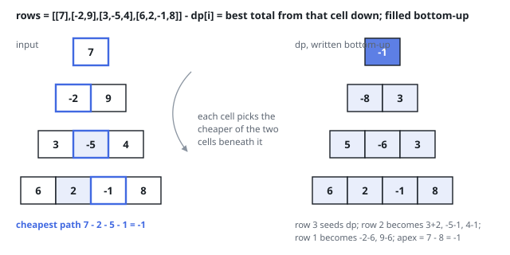

# Solutions — Cheapest Pyramid Path

One recurrence, read in two directions: descend from the apex extending
partial paths into the next row, or climb from the base folding each pair
of children into their parent. Both collapse the pyramid into a single
rolling row of totals, and they differ only in which end of the recursion
does the work and where the answer finally sits.

## top_down

Ask the opposite question at each cell: `best[i]` is the cheapest descent from
the apex to column `i` of the current row. The apex seeds `best` with its lone
value, and each row below reads the row above — an interior cell at `i`
arrives from `i - 1` or `i` and takes its own value plus the smaller of those
two arrivals. Where the climbing sweep merged two children per cell, this one
must write the two edge cells explicitly: the first cell of a row has only the
parent directly above, the last only the parent to its upper-left, and neither
has two parents to choose between.

Since a row grows rather than shrinks in this direction, the code builds a
fresh row per level instead of overwriting in place — current and previous row
together still never exceed one pyramid row. The direction also moves where
the answer is read: nothing collapses into the apex. Instead the finished
sweep leaves the cheapest arrival at every cell of the last row, and the
answer is the minimum over that row. On the worked example the last row of
`best` works out to `14, 2, -1, 28`, and the smallest of them, `-1` at column
2, is the answer — the same total the bottom-up sweep found at the apex.

A one-row input returns the apex directly, and negative entries behave as in
the other direction — sums are compared, never assumed positive.

**Complexity:** `O(n²)` time, `O(n)` space — one pass per cell, the two rows
are the only state.

## bottom_up

Starting at the base eliminates every boundary case. Let `dp[i]` be the
cheapest total from column `i` of the current row down to the bottom. The last
row needs no search — a path starting there is that cell alone — so it seeds
`dp` with its own values. One row up, a cell at column `i` can step to `i` or
`i + 1`, so its cheapest continuation is its own value plus the smaller of the
two sums already sitting beneath it. Each row folded this way shortens `dp` by
one entry, and when the apex is reached `dp[0]` is the answer.

One array suffices because a row reads only the row below it. Rewriting
`dp[i]` in place with `i` ascending reads `dp[i]` and `dp[i + 1]`, and the
`i + 1` entry is still the old row's value at the moment it is read. Climbing
also avoids the ragged edges that a descending sweep must special-case — here
every cell has exactly two children, including the ends of each row.

Negative values need no care — the recurrence compares sums, whatever their
sign — and a one-row input never enters the loop and returns its only value
unchanged. For the worked example the base seeds `6, 2, -1, 8`; the row above
folds to `3+2, -5-1, 4-1 = 5, -6, 3`; then `-2-6, 9-6 = -8, 3`; and the apex
takes `7 + (-8) = -1`.

Every one of the `n(n+1)/2` cells is folded exactly once and the rolling array
never exceeds one row.

**Complexity:** `O(n²)` time, `O(n)` space, for `n` rows.
