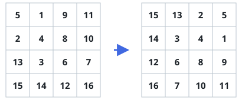

# Quarter-Turn The Square

## Description

A square grid `matrix` of numbers arrives, `n x n`. Turn it 90 degrees
clockwise — every element moves to the position its quarter turn dictates —
and hand the turned grid back.

The turn has to happen where the grid lives: rearrange the elements inside
the existing `matrix` rather than building a fresh grid for the result. The
judge here reads only what the call returns, so after rotating the contents
in place, return `matrix` itself.

### Example 1


```text
Input: matrix = [[1,2,3],[4,5,6],[7,8,9]]
Output: [[7,4,1],[8,5,2],[9,6,3]]
```

The first column, read bottom to top, becomes the first row of the result.

### Example 2



```text
Input: matrix = [[5,1,9,11],[2,4,8,10],[13,3,6,7],[15,14,12,16]]
Output: [[15,13,2,5],[14,3,4,1],[12,6,8,9],[16,7,10,11]]
```

A four-by-four grid follows the same rule: column `j`, read from the bottom,
lands as row `j`.

### Example 3

```text
Input: matrix = [[-1,-2,-3],[-4,-5,-6],[-7,-8,-9]]
Output: [[-7,-4,-1],[-8,-5,-2],[-9,-6,-3]]
```

Negative entries rotate exactly like any other value — only positions move,
never the numbers themselves.

### Constraints

- `n == matrix.length == matrix[i].length`
- `1 <= n <= 20`
- `-1000 <= matrix[i][j] <= 1000`
