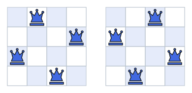

# Queen Layouts II

## Description

On an `n x n` chessboard, a queen attacks every square in her own row,
column, and the two diagonals through her square. A layout puts `n` queens
on the board so that no queen sees another.

Given `n`, count how many different layouts exist. Two layouts differ when
at least one queen sits on a different square, so mirror images count
separately; you return only the number, never the boards themselves.

### Example 1



```text
Input: n = 4
Output: 2
Explanation: On the 4 x 4 board exactly the two arrangements drawn above
keep all four queens out of each other's line of fire.
```

### Example 2

```text
Input: n = 5
Output: 10
```

### Constraints

- `1 <= n <= 9`
