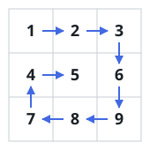
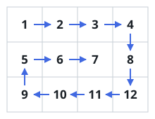

# Walk The Spiral

## Description

You are handed an `m x n` grid of integers. Read it out the way a spiral
visits it: begin at the top-left cell, sweep right along the top row, turn
and climb down the right edge, crawl back along the bottom row, then ride up
the left edge — at which point the unvisited cells form a smaller grid, and
the same four-legged walk repeats on it. Once every cell has been visited,
return the values in the order they were read, as one flat list.

### Example 1



```text
Input: matrix = [[1,2,3],[4,5,6],[7,8,9]]
Output: [1,2,3,6,9,8,7,4,5]
Explanation: The read leaves `1` heading right, hooks down the last column,
doubles back along the bottom, and climbs the first column before winding
into the center to collect `5`.
```

### Example 2



```text
Input: matrix = [[1,2,3,4],[5,6,7,8],[9,10,11,12]]
Output: [1,2,3,4,8,12,11,10,9,5,6,7]
Explanation: After the outer ring is read, the unvisited strip is a single
row, so the walk ends by sweeping it left to right.
```

### Example 3

```text
Input: matrix = [[3,-1,8],[0,12,5],[7,7,-4],[2,9,6]]
Output: [3,-1,8,5,-4,6,9,2,7,0,12,7]
```

### Constraints

- `m` and `n`, the row and column counts of `matrix`, both lie in `1..10`.
- Every cell value satisfies `-100 <= matrix[i][j] <= 100`.

## Hints

### Hint 1

Don't try to formula-map each cell to its spiral index — just simulate the
walk, moving the way the spiral moves.

### Hint 2

Track four moving edges — top, bottom, left, right — and read one straight
run per edge, pulling every edge inward after each full ring.

### Hint 3

When what remains has collapsed to one row or one column, the last two runs
of a ring would retrace the first two; guard them so nothing is read twice.
