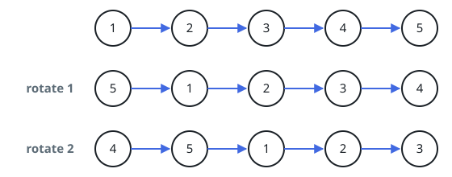
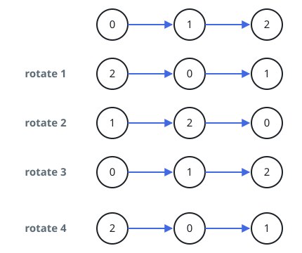

# Carry The Tail To The Front

## Description

You are given the `head` of a singly linked list and a step count
`k`. Turn the list `k` places to the right: each turn detaches the
last node and reattaches it ahead of everyone else, so after `k`
turns the final `k` nodes lead the list in their original order,
followed by what used to be the front. Return the head of the
reshuffled list.

### Example 1



```text
Input: head = [1,2,3,4,5], k = 2
Output: [4,5,1,2,3]
```

The last two nodes step forward twice; the list comes back led by
`4,5` with `1,2,3` trailing.

### Example 2



```text
Input: head = [0,1,2], k = 4
Output: [2,0,1]
```

Four turns over a three-node list leave just one net turn, so the
`2` moves up front.

### Constraints

- The list holds between `0` and `500` nodes.
- Every node's value sits in `[-100, 100]`.
- `0 <= k <= 2 * 10⁹`
