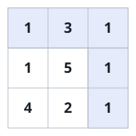

# The Cheapest Crossing

## Description

Every square of a grid charges a toll, given as a non-negative number.
You enter at the top-left square and leave at the bottom-right square,
and each step of the walk moves one square down or one square right.
The cost of a walk is the total of the tolls of every square it steps
on, including both corners. Find the smallest possible cost.

### Example 1



```text
Input: grid = [[1,3,1],[1,5,1],[4,2,1]]
Output: 7
```

Skirting the expensive middle square along the top and right edges
collects `1 → 3 → 1 → 1 → 1`, and no other route pays less.

### Example 2

```text
Input: grid = [[4,2,9],[1,5,3]]
Output: 13
```

Dropping down first and then running right along the bottom row pays
`4 → 1 → 5 → 3`, which beats every alternative.

### Constraints

- The grid has `m` rows and `n` columns; each row holds `n` tolls.
- `1 <= m, n <= 200`
- `0 <= grid[i][j] <= 200`
