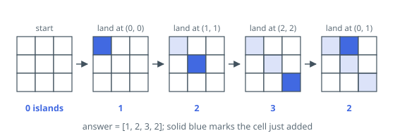

# Count Grid Islands, Land Updates

## Description

You are given an empty `m x n` grid: every cell starts as water. An array
`positions` then lists updates, where `positions[i] = [ri, ci]` names the cell
to turn into land at step `i`.

Return an array holding, after each update in turn, the number of islands then
present.

An **island** is a group of land cells joined edge to edge — touching at a
corner does not join two cells, and every cell outside the grid counts as
water.

### Example 1

```text
Input: m = 3, n = 3, positions = [[0,0],[1,1],[2,2],[0,1]]
Output: [1,2,3,2]
Explanation: The first three cells are pairwise diagonal, so each starts its
own island and the count climbs 1, 2, 3. The fourth update fills (0, 1),
which touches both the island at (0, 0) and the island at (1, 1), joining
them into one and dropping the count to 2.
```



### Example 2

```text
Input: m = 2, n = 2, positions = [[1,1],[1,1],[0,0],[1,0]]
Output: [1,1,2,1]
Explanation: Step 2 repeats a cell that is already land, so nothing changes
and the current count is reported again. The last update touches two islands
at once and merges them.
```

### Constraints

- `1 <= m, n, positions.length <= 10⁴`
- `1 <= m * n <= 10⁴`
- each entry of `positions` holds exactly two numbers
- `0 <= ri < m` and `0 <= ci < n` for every entry `[ri, ci]`

### Follow-up

Each update can be answered in `O(log(mn))` time or better, for
`k == positions.length` in total `O(k log(mn))`. How?

## Hints

### Hint 1

One update moves one cell, so the count moves by at most one in each
direction. Recounting the whole grid per update is the thing to avoid — carry
the count forward instead.

### Hint 2

Filling a cell creates one new island, and every _distinct_ island it touches
edge-to-edge then merges away. A cell that is already land leaves the count
exactly as it was.

### Hint 3

"Are these two land cells on the same island?" is the question a union-find
structure answers in almost constant time, and with path compression and
union by size it stays that cheap under repeated merges.
