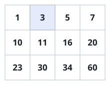
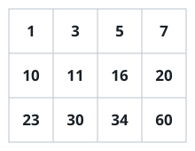

# A Matrix Sorted End To End

## Description

You are given an `m x n` grid of integers with two guarantees that
chain together:

- every row is sorted in non-decreasing order, and
- each row begins with a number strictly larger than the number that
  ends the row above it.

So reading the grid row by row, top to bottom, walks you through one
long non-decreasing sequence. Given a `target`, decide whether that
value appears anywhere in the grid.

Aim for `O(log(m * n))` time — the cost of one search over a single
list of `m * n` entries.

### Example 1



```text
Input: matrix = [[1,3,5,7],[10,11,16,20],[23,30,34,60]], target = 3
Output: true
```

### Example 2



```text
Input: matrix = [[1,3,5,7],[10,11,16,20],[23,30,34,60]], target = 13
Output: false
```

The value 13 falls in the gap between the rows ending at 7 and starting
at 10 plus their contents — no cell holds it.

### Example 3

```text
Input: matrix = [[2,4,6],[9,12,15],[18,21,24]], target = 24
Output: true
```

The target sits at the very end of the flattened reading order, a
boundary the search still reaches.

### Constraints

- `m == matrix.length`
- `n == matrix[i].length`
- `1 <= m, n <= 100`
- `-10⁴ <= matrix[i][j], target <= 10⁴`

## Hints

### Hint 1

Bin the candidates: the guarantees tell you exactly which row could
hold `target` before you look at any cell of it.

### Hint 2

Alternatively, number the cells `0` through `m * n - 1` in reading
order; the two guarantees make that numbering sorted, so one bisection
over the numbers suffices. Turning a flat index back into a row and
column is just divide and remainder by `n`.
