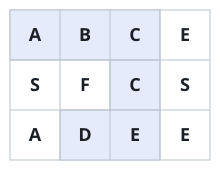
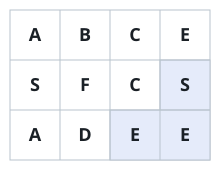
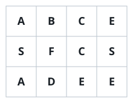

# Find Grid Word

## Description

You are given a `board` of letters shaped `m x n` and a string `word`.
Decide whether `word` can be traced somewhere on the board.

Tracing starts on any cell and moves one letter at a time to a
neighboring cell — up, down, left, or right — collecting the letters in
order. A single trace may never stand on the same cell twice, even
though different traces are free to reuse cells.

### Example 1



```text
Input: board = [["A","B","C","E"],["S","F","C","S"],["A","D","E","E"]], word = "ABCCED"
Output: true
```

### Example 2



```text
Input: board = [["A","B","C","E"],["S","F","C","S"],["A","D","E","E"]], word = "SEE"
Output: true
```

### Example 3



```text
Input: board = [["A","B","C","E"],["S","F","C","S"],["A","D","E","E"]], word = "ABCB"
Output: false
```

### Constraints

- `m == board.length`
- `n == board[i].length`
- `1 <= m, n <= 6`
- `1 <= word.length <= 15`
- `board` and `word` hold only upper and lower case English letters.

### Follow-up

Could pruning during the search make the method noticeably faster as
the board grows?
