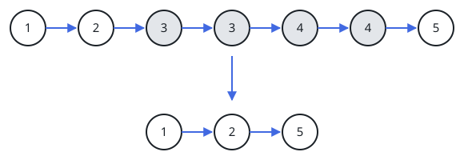
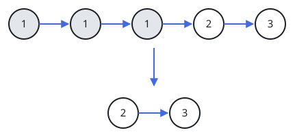

# Sorted List Cleanup II

## Description

A sorted linked list arrives with some of its values repeated, and
every copy of a repeated value sits in one unbroken run. Remove each
node whose value appears more than once — not down to a single
survivor per value, but out of the list entirely — and return the head
of what is left. Only removals happen, so whatever survives is still
sorted.

Equivalently: a value seen exactly once keeps its node, and a value
seen two or more times contributes nothing to the answer.

### Example 1



```text
Input: head = [1,2,3,3,4,4,5]
Output: [1,2,5]
```

The runs of 3s and 4s each disappear wholesale, while the values that
occurred once stay exactly where they were.

### Example 2



```text
Input: head = [1,1,1,2,3]
Output: [2,3]
```

The leading run of three 1s is gone completely — old head included —
so the surviving list starts at 2.

### Example 3

```text
Input: head = [-2,-2,0,3,3,4]
Output: [0,4]
```

Both duplicated values, the -2 pair and the 3 pair, are struck out
entirely; only the two once-seen values remain.

### Constraints

- The list holds between 0 and 300 nodes.
- Every node's value lies in the range `[-100, 100]`.
- The values are already arranged in ascending (non-decreasing) order
  from head to tail.
