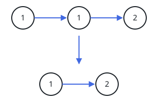
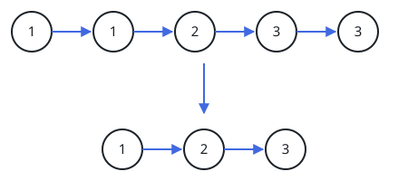

# Sorted List Cleanup

## Description

The `head` of a linked list arrives sorted in ascending order, but
repeated values have piled up into runs along it. Tidy the list by
unlinking nodes until every value survives exactly once, and give back
the cleaned list — still sorted, because nothing ever needs to move:
unlinked copies simply leave their runs behind.

### Example 1



```text
Input: head = [1,1,2]
Output: [1,2]
```

### Example 2



```text
Input: head = [1,1,2,3,3]
Output: [1,2,3]
```

### Constraints

- The list holds between `0` and `300` nodes.
- `-100 <= Node.val <= 100`
- The list is guaranteed to be sorted in ascending order.
