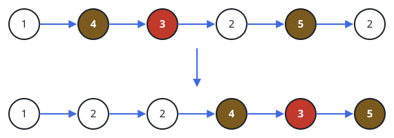

# Front-Load The Smaller Nodes

## Description

You are handed the head of a linked list and a divide value `x`.
Rebuild the list so that every node carrying a value below `x` stands
somewhere ahead of every node carrying `x` or more. The regrouping
must be stable: among the nodes that end up on the same side, the
order they had in the original list is kept exactly — nothing gets
sorted, values are merely split into a front group and a back group.
Return the head of the rebuilt list.

### Example 1



```text
Input: head = [1,4,3,2,5,2], x = 3
Output: [1,2,2,4,3,5]
```

The 1 and both 2s sit below the divide value, so they lead the result
in the order the walk met them; 4, 3, and 5 trail in theirs.

### Example 2

```text
Input: head = [6,5,3,4,1], x = 4
Output: [3,1,6,5,4]
```

The 3 and the 1 fall under 4 and move to the front without changing
places with each other; the larger values hold their own order behind
them.

### Example 3

```text
Input: head = [3,1,3,2,3], x = 3
Output: [1,2,3,3,3]
```

A value equal to the divide value belongs to the upper group, so only
the 1 and the 2 lead.

### Constraints

- The list holds between 0 and 200 nodes.
- Every node's value lies in the range `[-100, 100]`.
- The divide value `x` lies in the range `[-200, 200]`.
