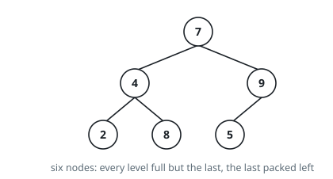

# Size Of A Complete Tree

## Description

A binary tree is _complete_ when its levels are filled level by level, left to
right: every level holds as many nodes as it can, except perhaps the last, and
whatever the last level holds sits flush against the left.

You are given `root`, the top node of a complete binary tree. Return how many
nodes it holds.

Visiting each node once would work, but the shape guarantee is worth more than
that: aim for an algorithm that inspects far fewer than `n` nodes.

### Example 1

```text
Input: root = [7,4,9,2,8,5]
Output: 6
Explanation: Two full levels, then a last level holding three nodes on the
left — six in all.
```



### Example 2

```text
Input: root = [4,2,6,1,3,5,7]
Output: 7
Explanation: Every level is completely filled — a perfect tree of depth three.
```

### Example 3

```text
Input: root = []
Output: 0
```

### Constraints

- the tree holds between `0` and `5 * 10⁴` nodes
- each node's value lies in `[0, 5 * 10⁴]`
- the tree is complete

## Hints

### Hint 1

From any node, you can measure two lengths cheaply: the run of left links down
the left edge, and the run of right links down the right edge. What does it
mean when the two runs come out equal?

### Hint 2

A subtree whose two edge runs agree is perfect, and a perfect tree of depth
`d` needs no traversal at all — its node count is a closed-form expression in
`d`.

### Hint 3

When the runs disagree, the raggedness is confined to the bottom level and
hugs the right side, so one of the two child subtrees must itself be perfect.
Recurse into both children, but notice that only one of them can stay ragged —
that is what keeps the total work far below `n`.
